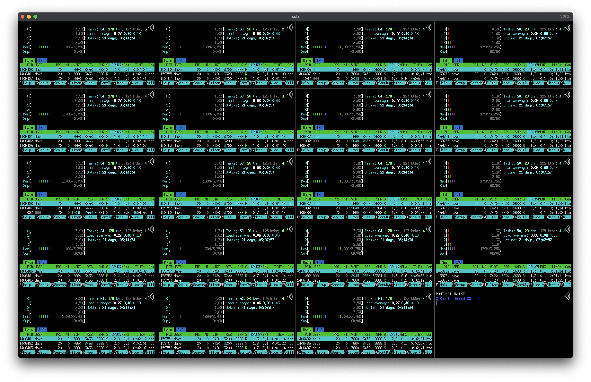

# csshi
A ClusterSSH utility (like [cssh](https://github.com/duncs/clusterssh)) for [iTerm2](https://iterm2.com/).

The command opens an iTerm2 Window and connects over ssh to each specified host in a [split pane](https://iterm2.com/features.html) session, with any text typed or pasted replicated to all panes through iTerm2's 'broadcast' feature. iTerm2's split pane controls are available as normal, so broadcast input can be toggled per-pane, sessions can be restarted, etc.



# Install

## Homebrew
* Install iTerm2 however you like.
* Install csshi:  
```$ brew install ilikejam/csshi/csshi```
* Enable the iTerm2 Python API at:  
`iTerm2` -> `Preferences...` -> `General` -> `Magic`

## Manual
* Install iTerm2 however you like.
* Install python3 e.g. with [homebrew](https://brew.sh/):  
```$ brew install python3```
* Install the python iterm2 and pyobjc libs through pip:  
```$ pip3 install iterm2 pyobjc```
* Clone this repo (or just download the 'csshi' file), make the csshi file executable, and maybe copy or link it to somewhere in your $PATH.
* Enable the iTerm2 Python API at:  
`iTerm2` -> `Preferences...` -> `General` -> `Magic`

# Usage  

```text
usage: csshi [-h] [-l USERNAME] [-p PORT] [-d] [-J JUMPHOST] [-o OPTIONS]
             [-C COLUMNS] [-k] [-b BINARY] [-s SLEEP]
             destination [destination ...]

Run multiple ssh connections concurrently in an iTerm2 terminal.

positional arguments:
  destination           [user@]host[:port] ssh server specification. Use
                        square brackets around IPv6 IP adresses.

options:
  -h, --help            show this help message and exit
  -l USERNAME, --username USERNAME
                        Login username, overridden per-host by specifying
                        'user@host'
  -p PORT, --port PORT  ssh server port, overridden per-host by specifying
                        'host:port
  -d, --debug           Turn on debugging
  -J JUMPHOST, --jump JUMPHOST
                        ProxyJump host specification, like
                        [user@]jumphost[:port]
  -o OPTIONS, --options OPTIONS
                        Raw ssh options string, e.g. '-i ~/.ssh/id_ansible'
  -C COLUMNS, --columns COLUMNS
                        Maximum number of columns.
  -k, --kill-inactive   Don't create spacer panes and kill inactive panes
  -b BINARY, --binary BINARY
                        SSH binary to use. Defaults to 'ssh'
  -s SLEEP, --sleep SLEEP
                        Sleep time in seconds between hosts. Defaults to 0
```

# Tips
Some preferences to optimise for shell density if you find yourself opening a lot of terminals in one csshi session:
* Disable pane menubars:  
`iTerm2` -> `Preferences...` -> `Appearance` -> `Panes` -> `Show per-pane title bar with split panes`  
You can still access the menu for each pane with Ctrl-click instead of the menubar burger icon
* Use a small font, like the original [misc-fixed 6x13](https://monkey.org/~marius/beautiful-fixed-width-fonts-for-osx.html), and disable antialiasing:  
`iTerm2` -> `Preferences...` -> `Profiles` -> `Text` -> `Anti-aliased`
* Decrease the 'Side' and 'Top & bottom' margins:  
`iTerm2` -> `Preferences...` -> `Appearance` -> `Panes`

# Contribute
Throw a PR over, raise an issue, send me an email.
